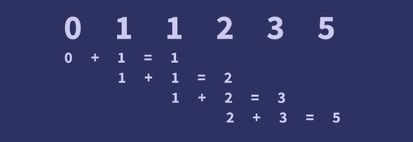
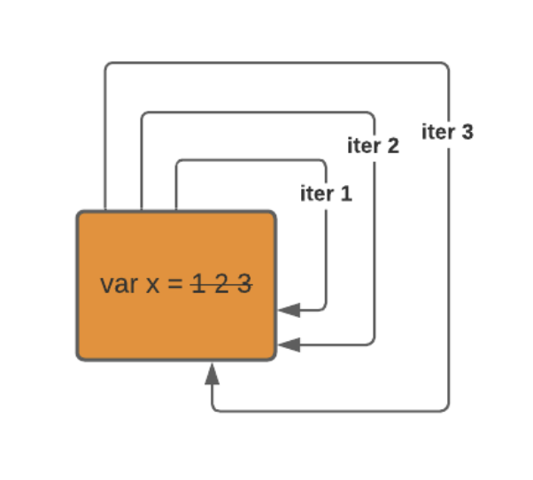
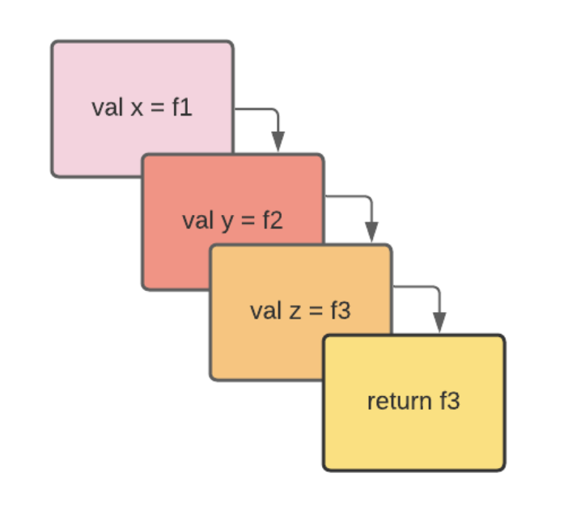

# Fibonacci Series
Fibonacci series is a series of numbers where the next number is the sum of the preceding two numbers.

It works as follow.


It can be approach in two ways, either recursively or iteratively. In this repository, I will compare both of the approaches based on the time and space complexity.

## Fibonacci Series using Iterative Method

```c
int iterativeFibonacci(int num){

    int num1 = 0;
    int num2 = 1;
    int output;

    if (num == 0){
        return num1;
    } else if (num == 1){
        return num2;
    } else{
        for(int i = 2; i <= num; i++){
            output = num1 + num2;
            num1 = num2;
            num2 = output;
        }
        return output;
    }
    
    
}
```
In the above program, the first and second number has assigned value 0 and 1 respectively, as the first and second number of the fibonacci series is fixed. 

If the given number is equal to 0 and 1, we return both given numbers.

If we pass a number that is greater than 0 and 1, then the value of the second number will be asgined as the first number, and the output will be assigned as the second number. These will be used to calculate the next element of the fibonacci series.

## Fibonacci Series using Recursive Method

``` c
int recursiveFibonacci(int num){

    if (num == 0){
        return 0;
    } else if (num == 1){
        return 1;
    } else{
        return recursiveFibonacci(num-1)+recursiveFibonacci(num-2);
    }
    
}
```

In the above program, if the given number is equal to 0 and 1, we return both given numbers.

If we pass a number that is greater than 0 and 1, then it will make two recursive calls where we add both calls with the nthNumber minus 1 and 2 in both calls.

## Testing
In this section, I will show how to test out both of the approaches and its outputs.

### Run:
```
make; ./main.out
```

### Output:
```
The fibonacci number for 14 is 377
The fibonacci number for 14 is 377
The fibonacci number F(0) = 0 = 0
The fibonacci number F(1) = 1 = 1
The fibonacci number F(2) = 1 = 1
The fibonacci number F(3) = 2 = 2
The fibonacci number F(4) = 3 = 3
The fibonacci number F(5) = 5 = 5
The fibonacci number F(6) = 8 = 8
The fibonacci number F(7) = 13 = 13
The fibonacci number F(8) = 21 = 21
The fibonacci number F(9) = 34 = 34
The fibonacci number F(10) = 55 = 55
The fibonacci number F(11) = 89 = 89
The fibonacci number F(12) = 144 = 144
The fibonacci number F(13) = 233 = 233
The fibonacci number F(14) = 377 = 377
```

As seen from the output, taking number 14 as the input, both iterative and recursive approaches have the same results.

## Benchmark
In this section, I will assess the performances of both iterative and recursive approahces through their time and space complexity.

### Time Complexity
### Iterative Approach
- Run:
```
make time-iterative; ./main_b_time_iterative.out
```

- Output:
```
Time elapsed: 0.000010 s
```


### Recursive Approach
- Run:
```
make time-recursive; ./main_b_time_recursive.out
```

- Output:
```
Time elapsed: 0.938666 s
```

As seen from the outputs, using the iterative approach is faster than the recursive approach.

### Space Complexity
I use N = 100 to test out the space complexity of both approaches. The outputs for the space complexity can be seen below (taken from Activity Monitor).
### Iterative Approach
- Run:
```
make space-iterative; ./main_b_space_iterative.out
```

- Output:


### Recursive Approach
- Run:
```
make space-recursive; ./main_b_space_recursive.out
```
- Output:


As seen from the outputs, the iterative approach takes up less space than the recursive approach.

## Conclusion
In conclusion, approaching the fibonacci series iteratively is faster and it takes up less space than doing it recursively. 

Iterative Block Diagram


Recursive Block Diagram


As seen from the illustrations above, this is because when doing the recursive approach, the program keeps adding and storing the redundant calls by recomputing the same values over and over again until you get the desired fibonacci result. Thus, taking up more time and space than the iterative approach, as it only stores the last two values and uses only those two values to calculate the desired fibonacci result.
